# E13 — Auth design

**Epic:** [E13](index.md) · **Settled by:** [F13.1](F13.1-auth-design.md)

**Depends on:** [ADR-0006](../../../adr/ADR-0006.md).

How authentication and authorization work in a new rn-forge web application: a pykit backend (Django or FastAPI) with an ngkit single-page app (SPA). This page is a working proposal shared by every E13 feature. Nothing in it is decided until it becomes an ADR or a feature. Later refinement sessions edit this page rather than starting over.

[Back to E13](index.md)

## Owner note

Carried verbatim from the owner's 2026-09-13 auth notes:

> SAML is a login flow into the provider. once logged in, it is a post back into the backend from where it could issue a JWT and all furture frontend to backend conversations happen using that JWT

Carried verbatim from the owner's 2026-09-27 direction:

> pykit should provide proven authN/AuthZ mechanism as per industry standard and best practices. It is supposed to help establish new webapps with open standards like SAML, OAuth, SSO, Social Login etc. The standard or pattern does not change whether it is a django or a fastapi based app.
>
> so the design should be as-if a new app is being setup today. we can then determine the delta that ew-loop needs when we look at reimplementing it with latest versions of pykit/ngkit

This design departs from the 2026-09-13 note on one point. After a SAML post-back, the backend starts a server-side session instead of issuing a JWT to the browser. [Why the browser holds a session](#why-the-browser-holds-a-session-and-not-a-token) gives the reasons.

## Starting point

pykit has no consumers yet. The auth code below was ported from an earlier custom implementation and is what this design replaces; [What this replaces](#what-this-replaces) maps each piece to its successor. The package guides describe how to use it today.

| Package | Holds |
| --- | --- |
| `rn-forge-commons` | JWKS fetch and cache, OIDC discovery and JWT verification (RFC 7519, RFC 7517, RFC 8414, OIDC Discovery 1.0). No HTTP server types. |
| `rn-forge-web` | `Principal`, credentials, the authentication and authorization protocols, `Requirement`, and the shared 401/403 problem response (RFC 6750 §3, RFC 7617, RFC 9457). The optional `OidcAuthenticator` maps verified claims to a principal. |
| `rn-forge-django` | The DRF binding of those contracts, plus Django session, SAML and locally issued JWT login flows. |
| `rn-forge-fastapi` | The FastAPI security-dependency binding. It validates bearer tokens an IdP issued and has no login or session layer. |

| Mechanism | `rn-forge-django` | `rn-forge-fastapi` |
| --- | --- | --- |
| Bearer (OIDC/OAuth 2.0 access token → `Principal`) | `PrincipalBearerAuthentication`, or `JWKSBearerAuthentication` from a JWKS URL | `bearer_auth()` |
| Basic (development and internal use) | `PrincipalBasicAuthentication` | `basic_auth()` |
| SAML (browser redirect → session) | `SAMLLoginViewMixin`, `SAMLLoginAPIView` | None |
| Local username/password → session or JWT | `BasicLoginAPIView`, `JWTAuthentication`, `UserTokenView` | None |

An absent or invalid credential produces 401 with a challenge; a valid principal missing a required scope produces 403 without one. Both framework bindings use the same `rn-forge-web` requirement rule. API keys, mutual TLS and signed requests need a custom `rn-forge-web` authenticator.

## Goals and non-goals

### Goals

1. One pattern for Django and FastAPI: the same HTTP surface, the same contracts and the same security controls. Only the framework binding differs.
2. Single sign-on (SSO) through OpenID Connect (OIDC) and SAML 2.0, social login through OIDC or OAuth 2.0, and optional local passwords.
3. Authorization that uses the application's own data (entitlements, org structure, tenancy) as well as what the identity provider (IdP) asserts.
4. An SPA that never handles tokens and still knows what to show the user.
5. Machine clients and downstream services that authenticate with standard bearer tokens.
6. Every flow testable offline: a development IdP and fake providers, with no switch that turns auth off.

### Non-goals

- pykit as an authorization server or token issuer ([ADR-0006](../../../adr/ADR-0006.md) stands).
- Registration, password reset, MFA enrollment and account recovery. These belong to the IdP, or to Django's own auth for local accounts.
- A SCIM server, and integration with an external policy engine (OPA, Cedar, OpenFGA). The contracts leave room for both.

## Principles

Each principle is a candidate ADR (see [Proposed decisions](#proposed-decisions)).

1. **Federate, then forget the protocol.** Every login method (OIDC, SAML, social, local, development) ends in the same `ExternalIdentity`. Nothing after that point knows which protocol ran.
2. **Browsers hold a session cookie, never tokens.** The backend is the browser's only party to the protocol (the backend-for-frontend, or BFF, pattern). Tokens, assertions and secrets stay on the server.
3. **Identity at login; authorization per request.** The session records who the user is and how they signed in. What they may do is computed on the server for each request from current data, and cached with explicit invalidation.
4. **The UI mirrors authorization but never decides it.** The SPA reads the user's effective permissions from `/auth/session` to show or hide features. The server enforces every check again.
5. **pykit consumes tokens and never mints them.** Bearer tokens for machine clients and downstream services come from an authorization server. pykit verifies them through the existing `OidcAuthenticator`.
6. **Proven libraries under pykit contracts.** Authlib for OIDC and OAuth 2.0 clients, python3-saml for SAML, and pykit's own `JwtVerifier` for JWT verification. pykit owns the contracts and the safe defaults, not the cryptography.

## Vocabulary

| Term | Meaning here |
| --- | --- |
| Identity provider (IdP) | The system that authenticates the user: Google Workspace, Entra ID, Okta, a social provider, or the app's local password store. |
| Broker | An IdP that federates to other IdPs and speaks one protocol to the app (Keycloak, Entra ID, Auth0, Zitadel, Authentik). |
| Relying party (RP) / service provider (SP) | The application backend in its OIDC or SAML role. |
| Login transaction | Server-side state for one login in flight: `state`, nonce, PKCE verifier, SAML request ID, `return_to`. Used once. |
| `ExternalIdentity` | The protocol-neutral result of a successful login: issuer, subject, verified profile claims, how and when the user authenticated. |
| Account | The application's record of a person, linked to one or more external identities. |
| Session | Server-side state tied to an HttpOnly cookie. It holds an account ID and authentication metadata only. |
| Authorization context | Permissions, roles and attributes computed for an account from current application data. |
| `Principal` | The verified caller for one request (`rn_forge.web.Principal`): identity plus the authorization context. It is the same type for session and bearer callers. |
| Permission | A named capability the application grants to users (`orders.update`). |
| Scope | An OAuth capability delegated to a client by a token. It limits a token; it does not grant a user anything. |
| Requirement | A declarative check against a principal (`rn_forge.web.Requirement`). |
| Resource policy | A per-object and per-query check: may this principal do this action to this record, and which records may they list. |

## System context

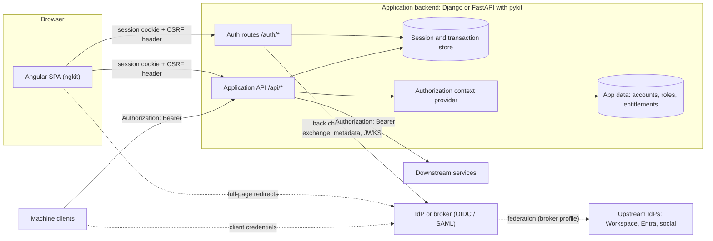

The SPA and the API are served from **one origin**, with a reverse proxy routing `/api` and `/auth` to the backend. Same-site is the minimum. This keeps the session cookie first-party and lets Angular's built-in XSRF support work, because Angular sends the XSRF header only to same-origin URLs. [Deployment topology](#deployment-topology) covers setups that cannot do this.

## Deployment profiles

Both profiles share everything after the `ExternalIdentity`. They differ only in how many protocols the backend speaks.

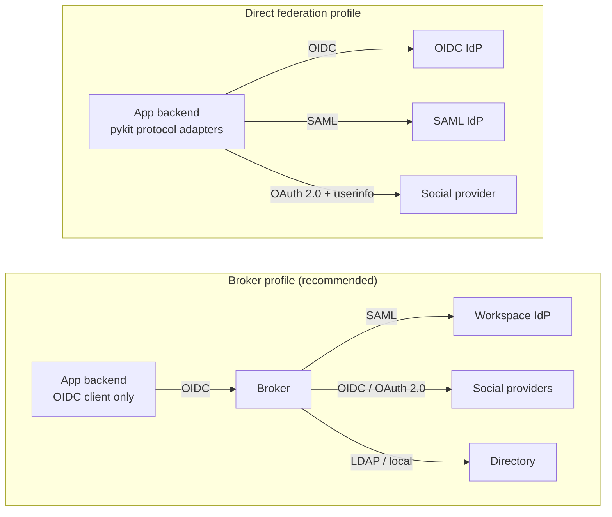

| | Broker profile | Direct federation profile |
| --- | --- | --- |
| Backend speaks | OIDC only | OIDC, SAML, OAuth 2.0, local |
| SAML and social set up | In the broker | In the app's provider configuration |
| Machine clients, mobile apps, several APIs | Supported: the broker issues tokens | Not supported without a broker, because pykit does not issue tokens |
| Operational cost | One more service to run, or a SaaS bill | None beyond the app |
| Choose when | More than one app or API, machine clients, or native apps | One backend, browser users only |

Recommendation: pykit supports both and treats the direct profile as a first-class option, not a fallback. Many small applications have one backend and one SSO provider, and they should not need Keycloak. Once a second API or a machine client appears, the answer is a broker, not token issuance in pykit.

## The pipeline

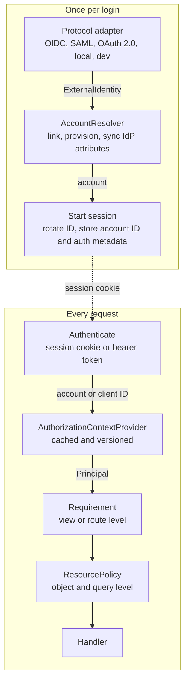

| Layer | Contract | Provided by pykit | Written by the application |
| --- | --- | --- | --- |
| Protocol adapter | `IdentityProvider` | OIDC, OAuth 2.0, SAML, local-password and development adapters; transaction handling; `return_to` validation | Provider configuration; claim and attribute mapping when the defaults do not fit |
| Account resolution | `AccountResolver` | Default resolver with a link table: link on (issuer, subject), provisioning policies | Provisioning policy; the rules for syncing IdP attributes onto the account |
| Session | framework binding | Session start and rotation, timeouts, CSRF, logout | Timeouts, if the defaults do not fit |
| Authorization context | `AuthorizationContextProvider` | Caching, versioning, invalidation API; a default provider from Django groups and permissions | Where entitlements come from (HR master, tenant tables, role mappings) |
| Requirement | `Requirement` | Declarative permission, role and scope checks; view action to permission key mapping | Permission keys on views and routes |
| Resource policy | `ResourcePolicy` | Hooks in both frameworks for object checks and query scoping | Row-level rules |

## Contracts

This is a sketch of the framework-neutral types, proposed for `rn-forge-auth` (see [Package placement](#package-placement)). Names and fields are open to refinement.

```python
@dataclass(frozen=True)
class ExternalIdentity:
    provider: str                 # configured provider id, e.g. "workspace"
    issuer: str                   # OIDC iss, or SAML IdP entity ID
    subject: str                  # OIDC sub, or SAML persistent NameID
    email: str | None = None
    email_verified: bool = False
    name: str | None = None
    groups: frozenset[str] = frozenset()
    attributes: Mapping[str, Any] = field(default_factory=dict)  # other mapped claims
    auth_time: datetime | None = None
    amr: frozenset[str] = frozenset()   # how the user authenticated (pwd, mfa, hwk)
    session_ref: str | None = None      # OIDC sid or SAML SessionIndex, for logout


class IdentityProvider(Protocol):
    id: str

    def begin(self, *, return_to: str) -> LoginStart:
        """Return the redirect (or form) and the LoginTransaction to persist."""

    def complete(
        self, callback: CallbackRequest, transaction: LoginTransaction
    ) -> ExternalIdentity:
        """Validate the IdP's response against the transaction."""

    def logout_redirect(
        self, session: SessionInfo, *, post_logout_redirect: str
    ) -> str | None:
        """Return the IdP's logout URL, or None for local logout only."""


class AccountResolver[AccountT](Protocol):
    def resolve(self, identity: ExternalIdentity) -> AccountT:
        """Link, provision or reject. Raises AccountRejected."""


@dataclass(frozen=True)
class AuthorizationContext:
    permissions: frozenset[str]
    roles: frozenset[str]
    attributes: Mapping[str, Any]   # ABAC inputs: tenant, org units, locations


class AuthorizationContextProvider(Protocol):
    def resolve(self, account_id: str) -> AuthorizationContext: ...


class ResourcePolicy[ResourceT, QueryT](Protocol):
    def allows(self, principal: Principal, action: str, resource: ResourceT) -> bool: ...
    def scope(self, principal: Principal, action: str, query: QueryT) -> QueryT: ...
```

`CallbackRequest` is a neutral view of the callback (method, URL, query, form, host, scheme) that each framework binding builds, so the SAML and OIDC adapters never see a Django or Starlette request.

Types that move from `rn-forge-web` to `rn-forge-auth`, and how they change:

- `Principal` gains `permissions: frozenset[str]`. `mechanism` takes `"session"` as well as `"bearer"` and `"basic"`. The authorization context's attributes go in `claims`.
- `Requirement` gains `any_permission` and `all_permissions`, which are ANDed with the existing scope and role clauses.
- The action-to-key mapping (`orders` + `partial_update` → `orders.update`), currently in the Django mixins, becomes a neutral helper that builds a `Requirement`. Both frameworks can then use it.

## HTTP surface

Django and FastAPI mount the same routes. The prefix is configurable. `{provider}` is a configured provider ID.

| Method | Path | Purpose | Response |
| --- | --- | --- | --- |
| `GET` | `/auth/providers` | Login options for the login page | `200` list of `{id, name, kind}` |
| `GET` | `/auth/login/{provider}?return_to=` | Start a login (full-page navigation, not XHR) | `302` to the IdP |
| `GET` | `/auth/callback/{provider}` | OIDC and OAuth 2.0 redirect URI | `302` to `return_to`, or to the SPA's error route |
| `POST` | `/auth/saml/{provider}/acs` | SAML Assertion Consumer Service | `303` to `return_to`, or to the error route |
| `GET` | `/auth/saml/{provider}/metadata` | SP metadata for the IdP administrator | `200` XML |
| `GET` | `/auth/session` | Current user for the SPA | `200` session body, or `401` problem |
| `POST` | `/auth/logout` | End the session (CSRF protected) | `200 {"redirect": url or null}` |
| `POST` | `/auth/backchannel-logout/{provider}` | OIDC Back-Channel Logout | `200` |
| `GET`, `POST` | `/auth/saml/{provider}/sls` | SAML Single Logout (optional) | `302` |
| `POST` | `/auth/login/password` | Local password login (optional provider) | `200` session body, or `401` |

The `/auth/session` body is the SPA's only source of identity and permissions:

```json
{
  "subject": "8f14e45f",
  "name": "Ada Lovelace",
  "email": "ada@example.com",
  "provider": "workspace",
  "roles": ["store-manager"],
  "permissions": ["orders.list", "orders.read", "orders.update"],
  "attributes": {"org_units": [{"type": "store", "id": "S-104"}]},
  "auth_time": "2026-09-27T09:12:44Z",
  "expires_at": "2026-09-27T17:12:44Z"
}
```

`attributes` is application-defined and should hold only what the UI needs. Callback errors redirect to the SPA's error route with a short, non-sensitive code (`?error=access_denied`). The details go to the log, never into the URL.

## Flows

### SPA bootstrap and session expiry

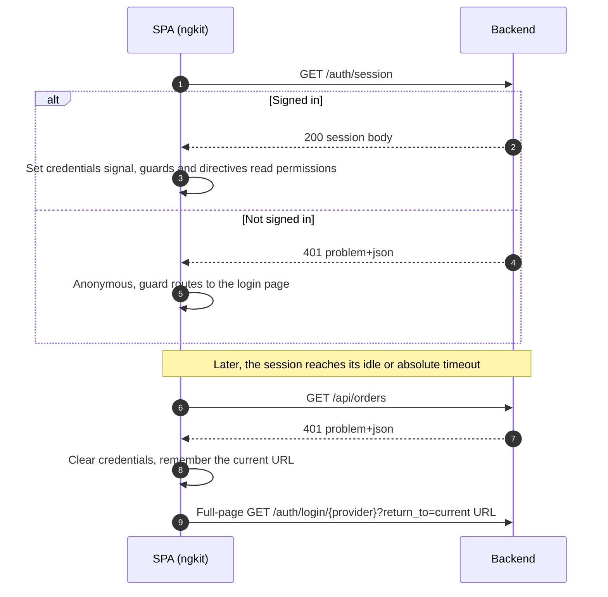

With a single configured provider the SPA may skip the login page and go straight to step 6. A `403` does not sign the user out. The SPA fetches `/auth/session` once, because permissions may have changed, and then shows a forbidden view.

### OIDC login (authorization code with PKCE)

This flow also covers social providers that speak OIDC, and every login in the broker profile.

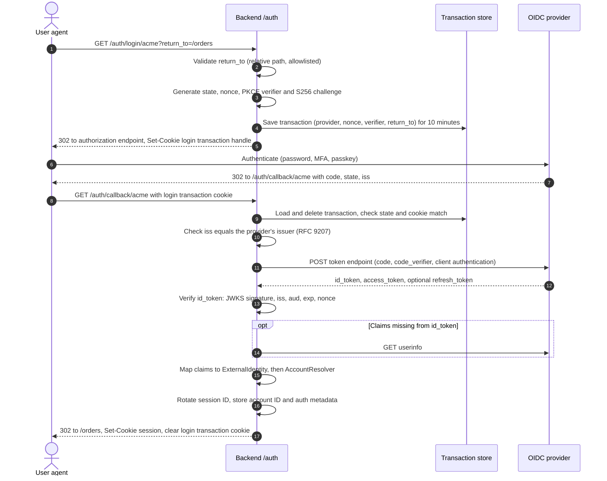

- PKCE is used even though the backend is a confidential client ([RFC 9700](https://www.rfc-editor.org/rfc/rfc9700) §2.1.1).
- The client never uses the implicit or password grant.
- The `id_token` is verified with `rn-forge-auth`'s `JwtVerifier` and its JWKS cache, so the app has one JWT verification path.
- Upstream access and refresh tokens are discarded by default. They are kept server-side only when the app calls upstream APIs on the user's behalf (see [Open questions](#open-questions)).
- For an OAuth 2.0-only social provider (no `id_token`), the adapter calls the provider's user endpoint over the back channel and maps the result. The same `ExternalIdentity` comes out.

### SAML login (SP-initiated, HTTP-POST binding)

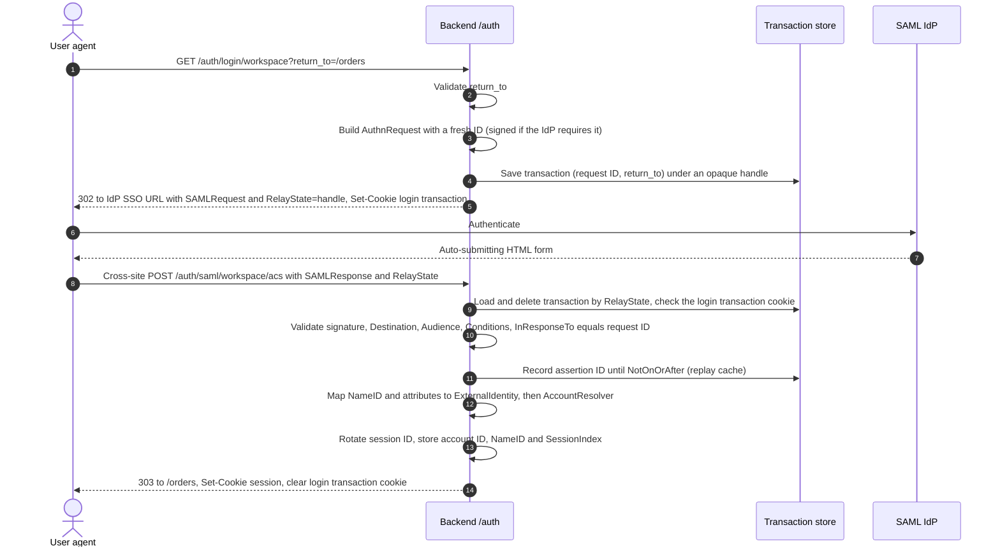

Points that are easy to get wrong:

- **RelayState is an opaque handle, not a URL.** The spec caps it at 80 bytes, and an unvalidated URL in it is an open redirect. `return_to` lives in the transaction.
- **The ACS POST is cross-site.** A `SameSite=Lax` session cookie is not sent with it. The login transaction cookie is therefore `SameSite=None; Secure`, scoped to `Path=/auth` and short-lived. The main session cookie stays `Lax`. The ACS endpoint skips CSRF checks, because the signed response and the transaction binding replace them.
- **`InResponseTo` is always checked**, which means the transaction's request ID is passed to python3-saml. IdP-initiated SSO has no `InResponseTo` and is open to login CSRF, so it is off by default. When a provider opts in, it requires the replay cache and a fixed landing page instead of `return_to`.
- **Link on a persistent NameID**, not on email, when the IdP can issue one. Signed assertions (not only a signed envelope), `strict` mode and a correct `Destination` are python3-saml settings that pykit's defaults turn on.

### Local password login (optional provider)

Local passwords are one more provider. The login page posts `{username, password}` with the CSRF header to `/auth/login/password`. The adapter verifies the password with the framework's hasher (Django's auth backends, or an application-supplied verifier on FastAPI) and returns an `ExternalIdentity` with `issuer="local"`. The rest of the pipeline is unchanged. The endpoint is rate-limited per account and per client, and its failures do not reveal whether the account exists. For production, SSO or passkeys are preferred.

A **development provider** has the same shape. It shows a list of fixture accounts, is available only when the app runs in debug mode, and replaces any "disable auth" switch. The auth path is then exercised in every environment.

### Authenticated request and authorization

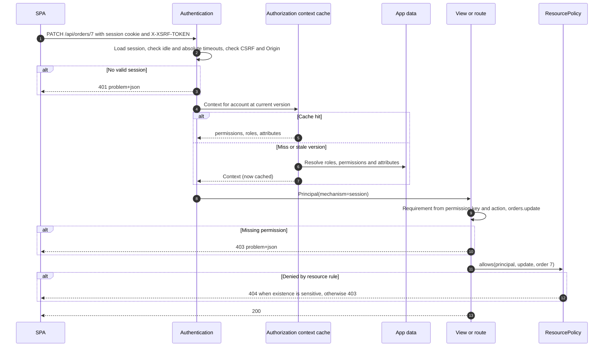

List endpoints call `ResourcePolicy.scope` to filter the query (a Django queryset, or a SQLAlchemy select), so a user never sees rows outside their scope. Checking each row after fetching them would also break pagination.

### Authorization changes

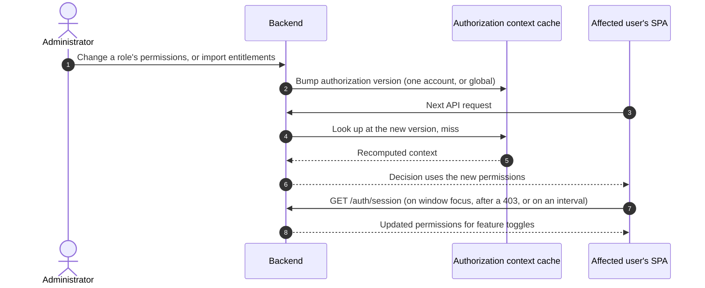

The server applies a change on the next request. The UI catches up on its next session fetch, and until then any action it still offers fails safely with `403`. A time-to-live (TTL) on cache entries bounds staleness when a change bypasses the invalidation hook, for example a direct database edit.

### Logout

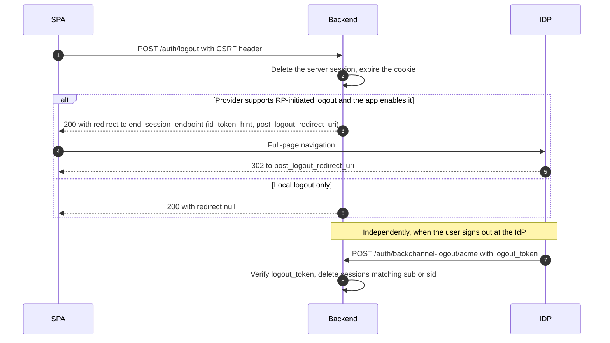

Logout at the IdP is optional per provider. Signing out of the app should not normally sign the user out of their whole Workspace or Entra session. SAML Single Logout is supported when configured but is unreliable across IdPs, so the local session timeouts do the real work.

### Machine clients and downstream services

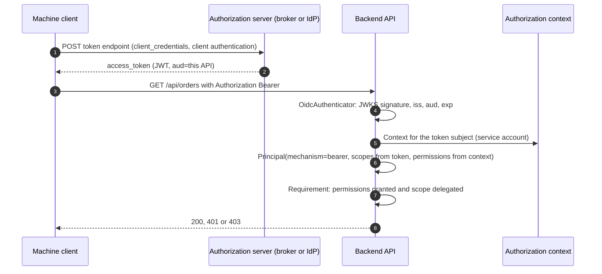

This path exists today (`OidcAuthenticator`, `PrincipalBearerAuthentication`, FastAPI `bearer_auth`). The change is that bearer principals also get an authorization context, so a service account has roles the way a user does. A user-delegated token is limited to what both the user's permissions and the token's scopes allow. When the application calls a downstream service, it uses its own client-credentials token. Forwarding a user's identity requires token exchange ([RFC 8693](https://www.rfc-editor.org/rfc/rfc8693)) at the broker (see [Open questions](#open-questions)).

## Sessions and cookies

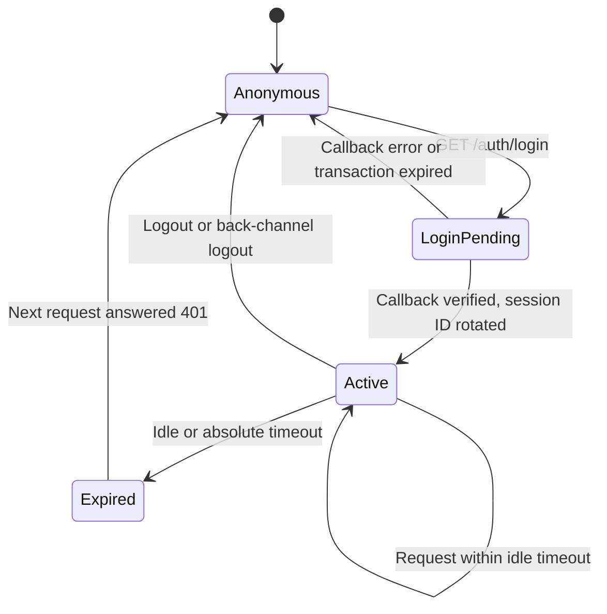

| Setting | Default | Reason |
| --- | --- | --- |
| Session storage | Server side: Django's database or cache sessions; a pykit session store on FastAPI | Supports revocation, back-channel logout and "sign out everywhere". Signed-cookie sessions cannot do these. |
| Session content | Account ID, provider, issuer, subject, `auth_time`, `amr`, `session_ref`, `id_token` if RP logout is enabled | Identity only. No permissions: those are computed per request. |
| Session cookie | `__Host-session`, `HttpOnly`, `Secure`, `SameSite=Lax`, `Path=/` | The `__Host-` prefix forbids `Domain`, so subdomains cannot plant or read the cookie. `Strict` would drop the cookie on the redirect back from the IdP. |
| Login transaction cookie | `__Secure-login-tx`, `HttpOnly`, `Secure`, `SameSite=None`, `Path=/auth`, `Max-Age=600` | Binds a callback to the browser that started it, including SAML's cross-site POST. |
| Idle timeout | 30 minutes, sliding | OWASP session management guidance; configurable. |
| Absolute timeout | 12 hours | Forces a fresh login and fresh IdP attributes at least daily. |
| Rotation | New session ID at login and on privilege change | Prevents session fixation. |
| CSRF | Token cookie readable by JavaScript and echoed in a header on unsafe methods, plus an `Origin` check | Matches Angular's `HttpClient` XSRF support. The cookie and header names are configured to agree on both sides. |

## Authorization model

- **Permissions are the unit of enforcement.** Keys are dotted, lowercase and stable, in the form `<resource>.<action>` with an optional namespace (`inventory.stock.adjust`). Views declare a base key, and the action map supplies the suffix. The application declares its catalog in code, and the same keys appear in `/auth/session` for the UI.
- **Roles group permissions.** A role is a named set of permissions. Accounts get roles directly, through groups, or through a mapping from IdP groups.
- **IdP attributes are a snapshot from login time.** Groups, titles and org units asserted by the IdP are written onto the account by the `AccountResolver` at each login. The authorization context reads them from there, alongside the application's live data (entitlement tables, an HR master, tenancy). Changes at the IdP between logins arrive at the next login, or immediately through SCIM if the application adds it later.
- **Attributes drive resource policy.** Tenant, org units and ownership feed `ResourcePolicy` for record-level decisions and query scoping. This is attribute-based access control (ABAC) layered on role-based access control (RBAC), which covers most line-of-business applications without an external policy engine.
- **Scopes limit tokens; they do not grant permissions.** For session principals, scopes are empty and do not apply.
- **Staff and superuser bypass is explicit.** It is a role that grants every permission, visible in `/auth/session`, not a hidden branch in the permission class.

## Account linking

- Link on `(issuer, subject)`. Never link on `(provider, email)` alone.
- Automatic linking of a new external identity to an existing account by email is allowed only when `email_verified` is true and the provider is configured as authoritative for that email domain. Otherwise a social provider with unverified emails becomes an account-takeover path.
- The provisioning policy is set per provider: `existing` (reject unknown users), `jit` (create on first login), or `jit` with an email-domain allowlist.
- A rejected login ends at the SPA's error route with `?error=account_not_provisioned` and is logged as an audit event.

## Security controls

| Control | Where it is enforced |
| --- | --- |
| `state`, nonce, PKCE S256, `iss` check | OIDC adapter and transaction store |
| `InResponseTo`, signed assertion, `Destination`, `Audience`, time conditions, assertion replay cache | SAML adapter and transaction store |
| One-time login transactions bound to the browser | Transaction store and transaction cookie |
| `return_to` accepts relative paths only, checked against configured prefixes | Protocol adapter, before the redirect |
| No tokens or assertions in URLs, browser storage or logs | BFF design; logging filters |
| Session ID rotation, idle and absolute timeouts | Framework session binding |
| CSRF token and `Origin` check on unsafe methods | Framework binding (Django middleware; pykit middleware on FastAPI) |
| 401 and 403 as RFC 9457 problems, with no detail on verification failures | Existing `rn-forge-web` contract |
| Rate limiting on `/auth/login/password` and callback endpoints | Framework binding, with configurable limits |
| Audit events: login success and failure, logout, account provisioned or rejected, authorization denied | `AppLogger` audit channel |
| Key rotation for JWKS, and SAML certificate rollover (two IdP certificates at once) | `rn-forge-auth`'s JWKS cache; SAML provider configuration |

## Package placement

**Recommendation:** a new package, `rn-forge-auth`, holding everything about identity and access that does not depend on a web framework. The name is `auth` rather than `identity` because the package covers authorization as well as authentication.

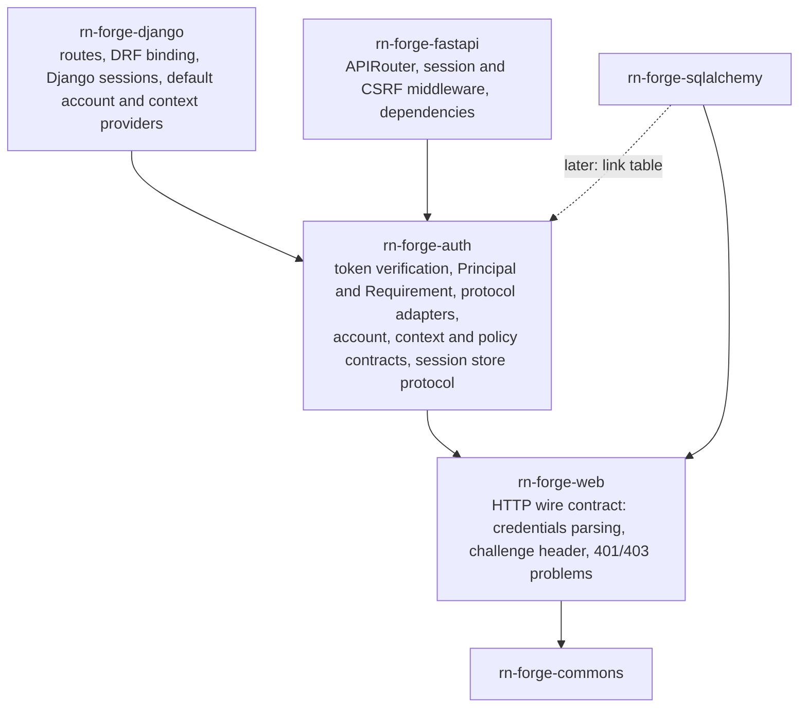

| Package | Gains | Loses |
| --- | --- | --- |
| `rn-forge-auth` (new) | `JwtVerifier`, JWKS cache, OIDC discovery and `fetch_json` from commons; `Principal`, `Requirement`, `Authenticator`, `AsyncAuthenticator`, `Authorizer`, `ScopeAuthorizer`, `principal_from_claims` and `OidcAuthenticator` from web; the new contracts; the adapters behind extras: `oidc` (Authlib, PyJWT), `saml` (python3-saml), `redis` (session store) | — |
| `rn-forge-web` | — | The types above and its `auth` extra. It keeps the wire contract: `Credentials`, `parse_authorization`, `challenge_header`, `AUTH_FAILED_DETAIL`, `AuthenticationFailed`, `PermissionDenied` and the problem responses. |
| `rn-forge-commons` | — | `rn_forge.commons.integration.auth` and its `auth` extra |
| `rn-forge-django`, `rn-forge-fastapi` | Bindings for the new contracts | Protocol code. Django's `saml` extra now depends on `rn-forge-auth[saml]`; its `jwt` extra is removed. |

Why a separate package instead of more extras on `rn-forge-web`:

- **`rn-forge-web` stays a thin HTTP contract.** `rn-forge-sqlalchemy` and applications without users take it without identity code.
- **Security-sensitive code has one home.** It gets its own version, changelog and review focus, and a security fix ships as one package.
- **The dependency surface is visible.** Authlib and SAML's native `xmlsec1` belong to a package whose purpose is obvious from its name.

The cost is one more package in the release batch, and breaking releases of `rn-forge-web`, `rn-forge-commons`, `rn-forge-django` and `rn-forge-fastapi`, because [ADR-0002](../../../adr/ADR-0002.md) forbids leaving aliases behind. Doing this before more applications adopt release-1 keeps that cost small. The `.importlinter` layers contract gains `rn_forge.auth` between the framework packages and `rn_forge.web`.

## Package responsibilities

| Package | Responsibility |
| --- | --- |
| `rn-forge-auth` | Token verification, including `id_token` and `logout_token`. The contracts above, `Principal` and `Requirement`, the versioned context cache, `return_to` validation, the session-body schema and the `SessionStore` protocol with an in-memory store. Behind optional extras: the OIDC and OAuth 2.0 adapters (Authlib), the SAML adapter (python3-saml) and a Redis session store. The local and development adapters need no extra. |
| `rn-forge-web` | The HTTP wire contract only: credential parsing, challenge headers, and 401 and 403 problems. |
| `rn-forge-django` | Binds the HTTP surface as views and URLconf. Transactions in Django's cache; sessions through `django.contrib.sessions`. A DRF authentication class that yields a session `Principal`. A default `AccountResolver` on the Django user model with an external-account link model. A default context provider from groups and permissions. DRF permissions built from `Requirement` and `ResourcePolicy`, plus queryset scoping. |
| `rn-forge-fastapi` | Binds the same HTTP surface as an `APIRouter`. Server-side session middleware over `rn-forge-auth`'s `SessionStore`, CSRF middleware, and `current_principal` and `requires` dependencies. |
| `rn-forge-sqlalchemy` | Later: a link table and default `AccountResolver` for FastAPI applications (see [Open questions](#open-questions)). |
| ngkit `@rn-forge/ng/auth` | The SPA client described next, tracked in ngkit's own epic. |
| Application | Provider configuration, claim mapping, provisioning policy, permission catalog, `AuthorizationContextProvider`, `ResourcePolicy` implementations, and calls to invalidate the context cache. |

## ngkit client contract

ngkit tracks its work in its own epic. This section is the contract that work builds against: a change here is a change to that contract.

- `provideRnForgeAuth({ sessionUrl, loginUrl, logoutUrl, providersUrl })` replaces the token configuration.
- On startup the client fetches `/auth/session` and sets the `RNF_CREDENTIALS` signal. `hasPermission` and `hasAnyPermission` read the `permissions` array.
- `login(provider, returnTo)` is a full-page navigation (`window.location.assign`), never an `HttpClient` call.
- `logout()` posts to `/auth/logout` and follows the returned `redirect` if there is one.
- The interceptor handles `401` by clearing credentials and starting a login with the current URL. It handles `403` by refetching the session once, then showing the forbidden route.
- `withXsrfConfiguration` is set to the backend's CSRF cookie and header names.
- Guards and directives (`authGuard`, `permissionGuard(keys)`, the permission directive) keep their current meaning and read the session-backed credentials.
- The client stores no tokens and makes no `jwt-decode` or `localStorage` calls for auth.
- Development uses the backend's development provider. `disableAuth` is removed.

## What this replaces

This list is kept so the delta can be planned. Each item becomes part of a feature, and removals follow [ADR-0002](../../../adr/ADR-0002.md): no aliases.

| Current | Becomes |
| --- | --- |
| `rn_forge.django.auth.jwt` (`JWTAuthentication`, `JWTCredentials`, `JWTUtils`, `LoginExchangeViewMixin`, `JWTAuthenticationViewMixin`, `UserTokenView`) and the `jwt` extra | Removed: sessions for browsers, broker-issued tokens for everything else |
| `BaseCredentials`, `LoginPayload` | `Principal` and `ExternalIdentity` |
| `auth.saml` views and `SampleSAMLLoginAPIView` | The SAML adapter plus the shared routes; the sample moves to the guide |
| `auth.basic` views | The local password provider |
| `AuthorizationViewMixin`, `PermissionKeyViewMixin`, `AuthorizationPermission` | A `Requirement` built from permission key and action, plus `ResourcePolicy` hooks |
| `rn_forge.web.auth` principal types, `rn_forge.web.oidc`, `rn_forge.commons.integration.auth` | Moved to `rn-forge-auth` ([Package placement](#package-placement)) |
| `PrincipalBearerAuthentication`, `JWKSBearerAuthentication`, `requires` | Kept, importing from `rn-forge-auth`; bearer principals also receive an authorization context |
| `User`, `Group` and `Permission` viewsets | Kept, as the administration surface for the default context provider |
| ngkit `JwtToken`, `JwtCredentials`, `LoginResponse`, token storage, `refreshToken` hook, `disableAuth` | Session-backed credentials and the development provider (ngkit's epic) |

The same exercise for an existing application such as ew-loop comes after this design is settled.

## Proposed decisions

These become ADRs when accepted:

1. **Browsers authenticate with a server-side session, never with tokens** (BFF). The SPA and API share an origin or a site.
2. **Every login method produces an `ExternalIdentity`, and accounts link on (issuer, subject).**
3. **Authorization is computed on the server per request.** Sessions and tokens carry identity only. The UI receives a copy of the permissions to show or hide features.
4. **[ADR-0006](../../../adr/ADR-0006.md) reaffirmed and extended.** pykit acts as a relying party and service provider, and its APIs accept tokens only from an authorization server. The locally issued JWT flows are removed.
5. **Django and FastAPI expose the same auth HTTP surface and security defaults.**
6. **Framework-neutral identity and access code lives in `rn-forge-auth`.** `rn-forge-web` keeps only the HTTP wire contract.

## Why the browser holds a session and not a token

- **Theft.** A token readable by JavaScript can be taken by any cross-site scripting (XSS) flaw and replayed from anywhere until it expires. An HttpOnly cookie cannot be read by script, and a server session can be revoked immediately. This is the direction of the IETF's [OAuth 2.0 for Browser-Based Applications](https://datatracker.ietf.org/doc/draft-ietf-oauth-browser-based-apps/) guidance, which recommends the BFF pattern as the most secure option for applications that have a backend.
- **Revocation and logout.** Back-channel logout, "sign out everywhere" and disabling a user all take effect on the next request. A self-contained JWT stays valid until it expires unless every API keeps a deny list.
- **Staleness and size.** Permissions or profile data in a token are frozen at issue time, grow every request, and expose personal data to anyone holding the token. Computing them per request with a cache is both fresher and smaller.
- **Less code where mistakes are costly.** Refresh-token rotation, storage and silent renewal in the SPA disappear. The flows that remain are the standard OIDC and SAML ones, run by maintained libraries.

The cost is a same-site deployment and CSRF protection, both of which are covered above.

## Deployment topology

- **Preferred:** one origin (`app.example.com` serves the SPA; `/api` and `/auth` are proxied to the backend).
- **Acceptable:** sibling subdomains of one registrable domain (`app.example.com`, `api.example.com`). The cookie is still same-site, but CORS with credentials and an explicit CSRF header configuration are needed, and the `__Host-` prefix still applies because the cookie belongs to the API host.
- **Different sites:** put a thin proxy on the SPA's origin. Do not fall back to tokens in the browser.
- **Native and mobile apps:** use the broker with authorization code and PKCE in the system browser ([RFC 8252](https://www.rfc-editor.org/rfc/rfc8252)), and call the API with bearer tokens. Native apps are not a reason for pykit to issue tokens.

## Standards

| Area | Reference |
| --- | --- |
| OAuth 2.0 and its security practice | [RFC 6749](https://www.rfc-editor.org/rfc/rfc6749), [RFC 9700](https://www.rfc-editor.org/rfc/rfc9700) (OAuth 2.0 Security Best Current Practice), [RFC 7636](https://www.rfc-editor.org/rfc/rfc7636) (PKCE), [RFC 9207](https://www.rfc-editor.org/rfc/rfc9207) (issuer identification) |
| OpenID Connect | [Core 1.0](https://openid.net/specs/openid-connect-core-1_0.html), [Discovery 1.0](https://openid.net/specs/openid-connect-discovery-1_0.html), [RP-Initiated Logout 1.0](https://openid.net/specs/openid-connect-rpinitiated-1_0.html), [Back-Channel Logout 1.0](https://openid.net/specs/openid-connect-backchannel-1_0.html) |
| SAML | [SAML 2.0 Core, Bindings and Profiles](https://docs.oasis-open.org/security/saml/v2.0/) |
| Browser applications | [OAuth 2.0 for Browser-Based Applications](https://datatracker.ietf.org/doc/draft-ietf-oauth-browser-based-apps/) (IETF draft) |
| Tokens | [RFC 7519](https://www.rfc-editor.org/rfc/rfc7519) (JWT), [RFC 8725](https://www.rfc-editor.org/rfc/rfc8725) (JWT best practices), [RFC 9068](https://www.rfc-editor.org/rfc/rfc9068) (JWT access tokens), [RFC 6750](https://www.rfc-editor.org/rfc/rfc6750) (bearer usage) |
| Sessions and cookies | [OWASP Session Management Cheat Sheet](https://cheatsheetseries.owasp.org/cheatsheets/Session_Management_Cheat_Sheet.html), [RFC 6265bis](https://datatracker.ietf.org/doc/draft-ietf-httpbis-rfc6265bis/) (cookie prefixes and `SameSite`) |
| Errors | [RFC 9457](https://www.rfc-editor.org/rfc/rfc9457) (problem details) |
| Provisioning (later) | [RFC 7644](https://www.rfc-editor.org/rfc/rfc7644) (SCIM) |

## Considered and rejected

- **Access and refresh JWTs held by the SPA** (in `localStorage`, `sessionStorage` or memory). Exposed to XSS, hard to revoke, and they need refresh-rotation code in every app.
- **Permissions, profile or org data inside a token.** Stale until expiry, bloats every request, and exposes personal data.
- **pykit minting its own JWTs after a login**, including the short-lived exchange token. This turns every app into an unaudited authorization server with its own key management, revocation and replay concerns. The current exchange token is also a valid SimpleJWT refresh token, redeemable at SimpleJWT's refresh endpoint.
- **Tokens in redirect URLs**, whether in the query or the fragment. They leak through history, logs and the `Referer` header.
- **Signed-cookie sessions** (Starlette's default `SessionMiddleware`). They cannot be revoked and their size is bounded by the cookie limit.
- **Linking accounts by email alone.** An account-takeover path through providers that do not verify email.
- **A "disable auth" switch in the SPA.** The auth code path goes untested in development. A development provider replaces it.
- **IdP-initiated SAML by default.** No `InResponseTo` means no binding to a request the app started. It stays opt-in, per provider.

## Open questions

Each question carries the recommendation from 2026-09-27. A question closes when the owner accepts or replaces the recommendation.

- **Where do the protocol adapters live?** *Recommendation:* in `rn-forge-auth`, behind extras ([Package placement](#package-placement)).
- **Which SAML library?** *Recommendation:* python3-saml. It is SP-focused with strict defaults and is already in use. pysaml2 is a full IdP and SP stack that is harder to configure, and both need `xmlsec1`. Revisit only if a required feature is missing.
- **FastAPI session store.** *Recommendation:* the `SessionStore` protocol with an in-memory store for tests and single-process development, and a Redis store behind the `redis` extra. Redis is the common production choice for server-side sessions. A SQL store waits until an application asks for one. Django keeps its own session framework.
- **FastAPI account model.** *Recommendation:* protocols only in the first version. A SQLAlchemy link table and default `AccountResolver` arrive when a FastAPI application with interactive users needs them.
- **Tokens held for upstream calls.** *Recommendation:* out of the first version. The OIDC adapter hands upstream tokens to an application hook and pykit does not store them.
- **Tenancy.** *Recommendation:* keep `Principal.tenant`, set by the authorization context provider. How a tenant is chosen at login waits for [F12.4](../E12-on-demand-features/index.md)'s trigger.
- **Step-up authentication.** *Recommendation:* the first version records `auth_time` and `amr` in the session and on the `Principal`. A `Requirement` clause for recent or multi-factor authentication waits for an application that needs it.
- **Test IdPs.** *Recommendation:* in-process fake OIDC and SAML IdPs for unit and integration tests, so acceptance runs offline inside this repository ([ADR-0008](../../../adr/ADR-0008.md)). A Keycloak container covers the broker profile in an optional CI job.
- Should a SAML post-back establish a session, issue a JWT for later frontend requests, or support both? *Recommendation:* a session (see [Why the browser holds a session](#why-the-browser-holds-a-session-and-not-a-token)). This closes when proposed decision 1 becomes an ADR.
